# DoDo Depth 高光谱重建前向架构说明

> 本文档主要描述原有 `whole_field` 前向。`psf卷积` 分支新增的 Baek 式深度-波长 PSF 卷积模型、兼容策略和运行参数见 `docs/psf_convolution_forward.md`。

本文档梳理当前项目中 `optical_model=dodo_depth` 这条训练链路，从 Baek 数据集原始 EXR 读取、patch 预处理、深度分层光学前向、sensor 测量归一化，到 Mamba U-Net 双头网络输出与 loss/validation 指标。公式尽量按代码中的真实实现书写，形状默认对应你近期训练命令中的主配置：

| 项 | 当前典型设置 |
|---|---:|
| patch size | `128 x 128` |
| 高光谱通道数 | `25` |
| 波长范围 | `420 nm` 到 `660 nm`，线性 25 个 band |
| 深度范围 | `0.4 m` 到 `2.0 m` |
| 深度分层 | `16` layers |
| 光学模型 | `dodo_depth` |
| depth layering | `soft_diopter` |
| DOE | `dodo_doe_type=New`，`optimize_optics=True` |
| 第二 DOE | `--no-dodo_use_second_doe`，默认不用 |
| prop2 | 默认走；若带 `--dodo_skip_prop2` 则跳过 |
| sensor 模式 | `rgb` |
| sensor 测量 | `intensity` 表示用光强 \(|U|^2\) |
| 光学 forward 归一化 | `fixed_scale`，即 \(Y=\mathrm{clip}(y_{\mathrm{sum}}/s_Y,0,1)\) |
| decoder 输入 | RGB measurement，通常 \(3\) 通道 |
| decoder 输出 | 25-band HS + 1-channel IPS depth |

主要代码位置：

| 功能 | 文件 |
|---|---|
| 数据集读取和 patch 预处理 | `datasets/hyperspectral_dataset.py` |
| Lightning 训练/验证/forward/loss | `snapshotdepth_hs.py` |
| DoDo depth 光学前向 | `torch_optics/forward_dodo.py` |
| Fresnel 传播 | `torch_optics/propagation.py` |
| DOE 相位调制 | `torch_optics/doe.py` |
| sensor 光谱响应 | `torch_optics/sensing.py` |
| decoder wrapper | `models/simple_model_mamba.py` |
| Mamba 双头 U-Net | `nets/mamba_unet.py`, `nets/mamba_helper.py` |
| HS loss | `util/hs_loss.py` |

## 1. 总体数据流

```mermaid
flowchart LR
    A[sceneXX_hs.exr<br/>sceneXX_depth_map.exr] --> B[EXR read<br/>HS + depth raw]
    B --> C[HS fixed scale normalize<br/>depth mm to m<br/>valid mask]
    C --> D[patch index / crop / jitter<br/>128 x 128]
    D --> E[DataLoader batch]
    E --> F[SnapshotDepthHS.forward]
    F --> G[DepthAwareDoDoForwardModel<br/>soft diopter depth layers]
    G --> H[prop1 per depth<br/>DOE1<br/>optional prop2<br/>optional DOE2<br/>prop3<br/>sensor]
    H --> I[y_sum + forward norm<br/>captimgs]
    I --> J[SimpleModelHS<br/>input adapter]
    J --> K[MambaDualHeadUNet]
    K --> L[est HS 25 bands<br/>est IPS depth]
```



默认张量约定：

| 符号 | 含义 | 形状 |
|---|---|---|
| \(B\) | batch size | 标量 |
| \(C\) | 高光谱 band 数 | \(25\) |
| \(K\) | depth layer 数 | \(16\) |
| \(H,W\) | patch 高宽 | \(128,128\) |
| \(M\) | 有效像素 mask | \([B,H,W]\) 或 \([B,1,H,W]\) |
| \(X\) | 归一化高光谱输入 | \([B,25,128,128]\) |
| \(Z\) | metric depth, meter | \([B,128,128]\) 或 \([B,1,128,128]\) |
| \(D\) | IPS depth target | \([B,128,128]\) |
| \(Y\) | 光学 sensor measurement | \([B,3,128,128]\) |
| \(\hat X\) | 网络重建高光谱 | \([B,25,128,128]\) |
| \(\hat D\) | 网络预测 IPS depth | \([B,128,128]\) |

## 2. 原始数据读取

### 2.1 EXR 文件

每个 scene 读取两个文件：

| 文件 | 内容 | 读取后形状 |
|---|---|---|
| `sceneXX_hs.exr` | 高光谱数据 | \([H_0,W_0,C_{\mathrm{raw}}]\) |
| `sceneXX_depth_map.exr` | 深度图 | \([H_0,W_0]\) 或 \([H_0,W_0,1]\) |

`read_exr()` 会按 EXR channel 名排序读取所有通道，并堆叠为：

\[
X_{\mathrm{raw}}\in\mathbb{R}^{H_0\times W_0\times C_{\mathrm{raw}}}
\]

随后只取前 `hs_channels=25` 个 band。代码是 Python slicing 的前 \(C\) 个通道：

\[
X_{\mathrm{raw}} \leftarrow X_{\mathrm{raw}}[:,:,:C]
\]

深度 EXR 会 squeeze 成二维深度图，并从毫米转为米：

\[
Z_{\mathrm{raw,m}}(u,v)=\frac{Z_{\mathrm{raw,mm}}(u,v)}{1000}
\]

### 2.2 有效像素 mask

背景深度通常为 0。代码把低于 `min_depth` 的位置视为无效背景：

\[
M(u,v)=
\begin{cases}
1,& Z_{\mathrm{raw,m}}(u,v)>z_{\min}-10^{-3}\\
0,& \text{otherwise}
\end{cases}
\]

其中：

\[
z_{\min}=0.4,\qquad z_{\max}=2.0
\]

形状：

| 变量 | 形状 |
|---|---|
| `valid_mask` | \([H_0,W_0]\) |
| `mask_tensor` before return | \([1,1,H_0,W_0]\) |
| `mask` after dataset return | \([H,W]\) |
| DataLoader 后 | \([B,H,W]\) |

## 3. 高光谱归一化

当前常用配置是：

```text
--hs_norm_mode fixed_scale
--hs_norm_scale 0.9367284796834017
--hs_sanity_threshold 10000.0
```

### 3.1 异常值处理

若高光谱最大值超过 sanity threshold，先把异常值裁剪到 scene 内低于阈值的最大值：

\[
s_{\mathrm{scene}}=
\max\{X_{\mathrm{raw}}(u,v,\lambda)\mid X_{\mathrm{raw}}(u,v,\lambda)<T\}
\]

\[
X_{\mathrm{clip}}=\mathrm{clip}(X_{\mathrm{raw}},0,s_{\mathrm{scene}})
\]

其中 \(T=10000\)。

若没有超过阈值，则：

\[
X_{\mathrm{clip}}=X_{\mathrm{raw}}
\]

### 3.2 fixed scale 归一化

fixed scale 模式使用一个全局固定尺度 \(s_X\)：

\[
s_X=0.9367284796834017
\]

归一化公式为：

\[
X_{\mathrm{norm}}(u,v,\lambda)
=
\mathrm{clip}
\left(
\frac{X_{\mathrm{clip}}(u,v,\lambda)}{s_X},
0,1
\right)
\]

形状变化：

\[
[H_0,W_0,25]\rightarrow[25,H_0,W_0]\rightarrow[1,25,H_0,W_0]
\]

如果训练或验证使用明确 patch window，代码会延迟 HS 归一化，只对最终裁剪出的 patch 归一化，避免每次扫描整张 HS 图。

## 4. 深度预处理

项目同时保留两种深度：

| 名称 | 用途 | 形状 |
|---|---|---|
| `depth_metric` | 光学前向的真实米制深度 | \([B,H,W]\) |
| `depth_map` | 网络监督的 IPS 归一化深度 | \([B,H,W]\) |

### 4.1 metric depth

无效背景会被 clamp 到最小深度，但后续用 mask 抑制：

\[
Z(u,v)=\mathrm{clip}(Z_{\mathrm{raw,m}}(u,v),z_{\min},z_{\max})
\]

其中 \(Z\) 是传入光学模型的 metric depth。

### 4.2 IPS depth target

`depth_map` 使用 inverse perspective sampling 归一化。代码实现为：

\[
D(u,v)
=
\frac{z_{\max}Z(u,v)-z_{\max}z_{\min}}
{(z_{\max}-z_{\min})Z(u,v)}
\]

等价写法：

\[
D(u,v)
=
\frac{\frac{1}{z_{\min}}-\frac{1}{Z(u,v)}}
{\frac{1}{z_{\min}}-\frac{1}{z_{\max}}}
\]

边界为：

\[
Z=z_{\min}\Rightarrow D=0,\qquad
Z=z_{\max}\Rightarrow D=1
\]

反变换在 metric-depth 评估和可视化中使用：

\[
Z
=
\frac{z_{\max}z_{\min}}
{z_{\max}-(z_{\max}-z_{\min})D}
\]

背景位置在构造 IPS 前被设为 \(z_{\min}\)，但训练 loss 会乘有效 mask。

## 5. Patch 采样与 Dataset 输出

当前常用 patch 配置：

```text
--image_sz 128
--patch_index_path ...npz
--patch_index_jitter 16
--patch_index_strict
--patch_index_use_meta_thresholds
```

Dataset 根据离线 patch index 选取窗口：

\[
(t,l)\in\mathcal{P}_{\mathrm{index}}
\]

在线 jitter 后：

\[
t'=t+\Delta_t,\qquad l'=l+\Delta_l
\]

其中：

\[
\Delta_t,\Delta_l\in[-16,16]
\]

窗口需要通过质量筛选：

| 条件 | 含义 |
|---|---|
| `min_valid_ratio` | patch 内有效 mask 比例 |
| `min_depth_range_ips` | patch 内 IPS depth 动态范围 |
| `min_center_valid_ratio` | 中心区域有效比例 |

最终 Dataset 返回：

| key | 单样本形状 | batch 后形状 |
|---|---:|---:|
| `hs_image` | \([25,128,128]\) | \([B,25,128,128]\) |
| `depth_map` | \([128,128]\) | \([B,128,128]\) |
| `depth_metric` | \([128,128]\) | \([B,128,128]\) |
| `mask` | \([128,128]\) | \([B,128,128]\) |

## 6. Lightning 前向入口

训练入口在 `SnapshotDepthHS.training_step()`：

\[
X=\texttt{samples['hs_image']}
\]

\[
D=\texttt{samples['depth_map']}
\]

\[
Z=\texttt{samples['depth_metric']}
\]

\[
M=\texttt{samples['mask']}
\]

`crop_width=0` 时，边界 mask 不改变空间尺寸：

\[
M_{\mathrm{final}}=M\odot M_{\mathrm{boundary}}=M
\]

进入 `SnapshotDepthHS.forward()` 后，对于 `dodo_depth`：

\[
X_{\mathrm{linear}}=X\odot M
\]

这里 mask 会广播到 25 个高光谱通道：

\[
X_{\mathrm{linear}}\in\mathbb{R}^{B\times25\times128\times128}
\]

然后调用：

```python
captimgs = self.camera(images_linear, depth_metric, valid_mask=valid_mask)
```

对应：

\[
Y=\mathcal{A}_{\theta}(X_{\mathrm{linear}},Z,M)
\]

其中 \(\mathcal{A}_{\theta}\) 是 depth-aware DoDo 光学前向，\(\theta\) 包含 DOE 的 Zernike 系数。

## 7. Depth-aware DoDo 光学前向

光学前向输入：

| 输入 | 形状 | 含义 |
|---|---:|---|
| `spectral` | \([B,25,128,128]\) | 归一化 HS patch |
| `depth` | \([B,128,128]\) 或 \([B,1,128,128]\) | metric depth, meter |
| `valid_mask` | \([B,128,128]\) 或 \([B,1,128,128]\) | 有效区域 |

输出：

| 输出 | 形状 | 含义 |
|---|---:|---|
| `captimgs` | \([B,3,128,128]\) | RGB sensor measurement |

### 7.1 深度分层：soft diopter

当前使用 `depth_layering_mode=soft_diopter`。先定义屈光度：

\[
U(u,v)=\frac{1}{\mathrm{clip}(Z(u,v),z_{\min},z_{\max})}
\]

深度层中心在屈光度空间均匀采样：

\[
u_k=\mathrm{linspace}\left(\frac{1}{z_{\max}},\frac{1}{z_{\min}},K\right)_k
\]

对应的米制深度中心：

\[
z_k=\frac{1}{u_k}
\]

相邻屈光度间距：

\[
\Delta u=u_{k+1}-u_k
\]

三角核 raw weight：

\[
\tilde w_k(u,v)
=
\max\left(
0,
1-\frac{|U(u,v)-u_k|}{\Delta u\cdot\beta}
\right)M(u,v)
\]

其中 \(\beta=\texttt{soft_diopter_bandwidth_scale}\)，当前一般为 \(1.0\)。

归一化后：

\[
w_k(u,v)
=
\frac{\tilde w_k(u,v)}
{\sum_{j=1}^{K}\tilde w_j(u,v)+\epsilon}
M(u,v)
\]

形状：

\[
w\in\mathbb{R}^{B\times K\times128\times128}
\]

每个深度层得到一个 masked spectral field：

\[
X_k(b,\lambda,u,v)
=
X(b,\lambda,u,v)\,w_k(b,u,v)
\]

形状：

\[
X_k\in\mathbb{R}^{B\times25\times128\times128}
\]

### 7.2 Fresnel 传播层

`PropagationLayer` 使用频域 Fresnel 传播。对每个波长 \(\lambda\)：

\[
\lambda_i
=
\mathrm{linspace}(420,660,25)_i\ \mathrm{nm}
\]

空间采样：

\[
\Delta x=\frac{L}{M_p}
\]

频率网格：

\[
f_x,f_y\in
\left[
-\frac{1}{2\Delta x},
\frac{1}{2\Delta x}-\frac{1}{L}
\right]
\]

传播核：

\[
H_{\lambda,z}(f_x,f_y)
=
\exp\left(
-i\pi\lambda z(f_x^2+f_y^2)
\right)
\]

传播算子：

\[
\mathcal{P}_{\lambda,z}(U)
=
\mathcal{F}^{-1}
\left[
\mathcal{F}(U)\,H_{\lambda,z}
\right]
\]

输出为 complex field：

\[
\mathcal{P}_{\lambda,z}(U)\in\mathbb{C}^{B\times25\times128\times128}
\]

### 7.3 DOE 相位调制

对于 `dodo_doe_type=New` 或 `Zeros`，DOE height map 由 Zernike basis 线性组合得到：

\[
h(x,y)=\sum_{m=1}^{N}c_m Z_m(x,y)
\]

其中 \(c_m\) 是可训练或冻结的 Zernike 系数。`New` 下前若干系数随机初始化，且在 `optimize_optics=True` 时参与优化。

折射率使用代码中的 Cauchy-like 公式：

\[
n(\lambda_{\mu m})
=
1.5375
+0.00829045\lambda_{\mu m}^{-2}
-0.000211046\lambda_{\mu m}^{-4}
\]

\[
\Delta n(\lambda)=n(\lambda)-1
\]

DOE 相位因子：

\[
D_{\lambda}(x,y)
=
\exp\left(
i\frac{2\pi}{\lambda}
\Delta n(\lambda)h(x,y)
\right)
\]

DOE 调制：

\[
U_{\lambda}^{+}(x,y)
=
U_{\lambda}^{-}(x,y)D_{\lambda}(x,y)
\]

形状保持：

\[
[B,25,128,128]\rightarrow[B,25,128,128]
\]

### 7.4 每个深度层的光学链路

对每个 depth layer \(k\)，代码链路为：

1. 根据该层深度中心传播到 DOE1：

\[
U_{k,\lambda}^{(1)}
=
\mathcal{P}_{\lambda,z_k}
\left(
X_{k,\lambda}
\right)
\]

2. DOE1 相位调制：

\[
U_{k,\lambda}^{(2)}
=
D_{1,\lambda}U_{k,\lambda}^{(1)}
\]

3. 可选 prop2：

默认没有 `--dodo_skip_prop2` 时会执行：

\[
U_{k,\lambda}^{(3)}
=
\mathcal{P}_{\lambda,0.05}
\left(
U_{k,\lambda}^{(2)}
\right)
\]

若命令中带：

```text
--dodo_skip_prop2
```

则：

\[
U_{k,\lambda}^{(3)}=U_{k,\lambda}^{(2)}
\]

4. 可选 DOE2：

如果 `--dodo_use_second_doe` 打开：

\[
U_{k,\lambda}^{(4)}
=
D_{2,\lambda}U_{k,\lambda}^{(3)}
\]

当前典型命令是 `--no-dodo_use_second_doe`，因此：

\[
U_{k,\lambda}^{(4)}=U_{k,\lambda}^{(3)}
\]

5. prop3 到 sensor：

\[
U_{k,\lambda}^{(s)}
=
\mathcal{P}_{\lambda,0.01}
\left(
U_{k,\lambda}^{(4)}
\right)
\]

代码中的固定传播参数：

| stage | `L` | `z` |
|---|---:|---:|
| `prop1_layers[k]` | `0.01` | \(z_k\) |
| `prop2` | `0.006` | `0.05` |
| `prop3` | `0.0048` | `0.01` |

### 7.5 Sensor 测量

`SensingLayer` 先把 complex field 转成幅值或光强：

若 `dodo_sensor_measurement=amplitude`：

\[
Q_{k,\lambda}(u,v)
=
\left|U_{k,\lambda}^{(s)}(u,v)\right|
\]

若 `dodo_sensor_measurement=intensity`：

\[
Q_{k,\lambda}(u,v)
=
\left|U_{k,\lambda}^{(s)}(u,v)\right|^2
\]

当前你的训练命令使用 `intensity`。

`dodo_sensing_mode=rgb` 时加载 `Sensor_25_new3.mat` 中的 \(R,G,B\) 光谱响应。对每个 RGB 通道 \(c\)：

\[
y_{k,c}(u,v)
=
\sum_{\lambda=1}^{25}
S_c(\lambda)Q_{k,\lambda}(u,v)
\]

其中：

\[
c\in\{R,G,B\}
\]

形状：

\[
y_k\in\mathbb{R}^{B\times3\times128\times128}
\]

若使用 `spectral_bins`，则响应矩阵是连续等宽 band 分箱：

\[
y_{k,c}(u,v)
=
\sum_{\lambda=1}^{25}
R_{\lambda,c}Q_{k,\lambda}(u,v)
\]

若使用 `identity`，则输出 25 个 band：

\[
y_{k,\lambda}=Q_{k,\lambda}
\]

### 7.6 深度层求和得到 `y_sum`

所有 depth layer 的 sensor 输出相加：

\[
y_{\mathrm{sum}}(b,c,u,v)
=
\sum_{k=1}^{K}y_k(b,c,u,v)
\]

形状：

\[
y_{\mathrm{sum}}\in\mathbb{R}^{B\times3\times128\times128}
\]

这一步就是当前代码中的 `y_sum`。它不是原始 HS 数据，而是：

\[
\text{normalized HS}
\rightarrow
\text{depth soft layering}
\rightarrow
\text{per-layer propagation}
\rightarrow
\text{DOE modulation}
\rightarrow
\text{sensor spectral response}
\rightarrow
\text{sum over depth layers}
\]

得到的模拟传感器图像。

### 7.7 光学 forward 归一化

`DepthAwareDoDoForwardModel` 内部支持四种 `dodo_forward_norm`。

#### none

\[
Y=y_{\mathrm{sum}}
\]

#### per_sample_max

每个样本各自除以最大值：

\[
Y_b
=
\frac{y_{\mathrm{sum},b}}
{\max_{c,u,v}y_{\mathrm{sum},b,c,u,v}+10^{-8}}
\]

#### fixed_scale

当前常用设置：

```text
--dodo_forward_norm fixed_scale
--dodo_forward_scale 3.7003112959862983
```

公式：

\[
Y
=
\mathrm{clip}
\left(
\frac{y_{\mathrm{sum}}}{s_Y+10^{-8}},
0,1
\right)
\]

其中：

\[
s_Y=3.7003112959862983
\]

#### legacy_max

对整个 batch/global tensor 除以最大值：

\[
Y
=
\frac{y_{\mathrm{sum}}}
{\max(y_{\mathrm{sum}})+10^{-8}}
\]

输出 `captimgs`：

\[
Y\in\mathbb{R}^{B\times3\times128\times128}
\]

## 8. 光学输出到 decoder 前的处理

`SnapshotDepthHS.forward()` 得到 `captimgs` 后会做三类处理。

### 8.1 非有限数检查

如果 `captimgs` 中出现 NaN 或 Inf：

| `dodo_nonfinite_policy` | 行为 |
|---|---|
| `fail` | 直接抛错停止训练 |
| `zero` | 用 0 替换继续训练 |

你近期命令中通常使用：

```text
--dodo_nonfinite_policy fail
```

### 8.2 可选 measurement norm

这是 `dodo_measurement_norm`，发生在 `dodo_forward_norm` 之后、decoder 之前。

当前命令一般为：

```text
--dodo_measurement_norm none
```

若开启 `per_sample_mean_std`：

\[
Y_b
\leftarrow
\frac{Y_b-\mu_b}{\sigma_b+10^{-6}}
\]

若开启 `per_sample_minmax`：

\[
Y_b
\leftarrow
\frac{Y_b-\min(Y_b)}
{\max(Y_b)-\min(Y_b)+10^{-6}}
\]

### 8.3 噪声

训练时加入高斯噪声：

\[
\sigma_b\sim\mathcal{U}(\sigma_{\min},\sigma_{\max})
\]

\[
Y_b\leftarrow Y_b+\sigma_b\epsilon_b,\qquad
\epsilon_b\sim\mathcal{N}(0,I)
\]

你近期命令中：

\[
\sigma_{\min}=0,\qquad \sigma_{\max}=0
\]

因此实际不加噪声。

### 8.4 可选 decoder depth input

若开启：

```text
--decoder_use_depth_input
```

则会把归一化深度特征拼到 `captimgs` 后面，decoder 输入从 3 通道变成 4 通道。

`normalized_diopter` 模式：

\[
F_Z
=
\frac{\frac{1}{Z}-\frac{1}{z_{\max}}}
{\frac{1}{z_{\min}}-\frac{1}{z_{\max}}}
\]

`normalized_z` 模式：

\[
F_Z
=
\frac{Z-z_{\min}}{z_{\max}-z_{\min}}
\]

当前命令是：

```text
--no-decoder_use_depth_input
```

因此 decoder 输入仍为：

\[
Y\in\mathbb{R}^{B\times3\times128\times128}
\]

## 9. Decoder：SimpleModelHS

当前 decoder 是：

```python
models.simple_model_mamba.SimpleModelHS
```

由于 `dodo_depth` 会强制：

```text
preinverse=False
```

所以 decoder 不使用传统 Tikhonov preinverse volume。代码仍会构造一个零张量：

\[
V_{\mathrm{pinv}}=\mathbf{0}
\in
\mathbb{R}^{B\times(25\cdot n_{\mathrm{depths}})\times128\times128}
\]

但在 `preinverse=False` 时不会拼接到输入。

### 9.1 Input adapter

输入：

\[
Y\in\mathbb{R}^{B\times3\times128\times128}
\]

经过两层 \(3\times3\) Conv + Norm + ReLU：

\[
F_0
=
\phi_{\mathrm{stem}}(Y)
\in
\mathbb{R}^{B\times32\times128\times128}
\]

其中 `decoder_norm=group` 时使用 GroupNorm，`decoder_norm=batch` 时使用 BatchNorm。

当前典型命令：

```text
--decoder_norm group
```

## 10. MambaDualHeadUNet

主干网络输入：

\[
F_0\in\mathbb{R}^{B\times32\times128\times128}
\]

网络通道配置：

\[
[32,64,128,256,512,1024]
\]

### 10.1 Encoder

Encoder 有 4 层，每层输出 skip 和 pool 后特征：

| stage | 输入 | skip 输出 | pool 输出 |
|---|---:|---:|---:|
| enc1 | \([B,32,128,128]\) | \([B,64,128,128]\) | \([B,64,64,64]\) |
| enc2 | \([B,64,64,64]\) | \([B,128,64,64]\) | \([B,128,32,32]\) |
| enc3 | \([B,128,32,32]\) | \([B,256,32,32]\) | \([B,256,16,16]\) |
| enc4 | \([B,256,16,16]\) | \([B,512,16,16]\) | \([B,512,8,8]\) |

`mamba_scheme=hybrid` 时，第一层使用 CNN block，后续层使用 VSSBlock。默认未显式给 `mamba_scheme` 时也是 `hybrid`。

### 10.2 VSSBlock 公式和形状

VSSBlock 输入：

\[
F\in\mathbb{R}^{B\times C\times H\times W}
\]

先展平成序列：

\[
S=\mathrm{reshape}(F)
\in
\mathbb{R}^{B\times(HW)\times C}
\]

LayerNorm + Mamba：

\[
S'=\mathrm{Mamba}(\mathrm{LN}(S))
\]

残差连接：

\[
F'
=
F+\mathrm{reshape}^{-1}(S')
\]

形状保持：

\[
[B,C,H,W]\rightarrow[B,C,H,W]
\]

### 10.3 Bottleneck

encoder 最后得到：

\[
F_4^{\mathrm{pool}}\in\mathbb{R}^{B\times512\times8\times8}
\]

瓶颈层：

\[
B_0
=
\mathrm{VSSBlock}
\left(
\mathrm{Conv}_{1\times1}(F_4^{\mathrm{pool}})
\right)
\]

形状：

\[
B_0\in\mathbb{R}^{B\times1024\times8\times8}
\]

### 10.4 双 decoder 分支

网络有两个 decoder head：

| 分支 | 输出 |
|---|---|
| depth branch | 1-channel depth logits |
| HS branch | 25-channel HS logits |

两个分支都从 bottleneck 开始，逐层上采样并拼接对应 skip。

#### Depth branch

| stage | 操作后形状 |
|---|---:|
| up4 + skip4 + conv | \([B,512,16,16]\) |
| up3 + skip3 + conv | \([B,256,32,32]\) |
| up2 + skip2 + conv | \([B,128,64,64]\) |
| up1 + shallow skip + conv | \([B,64,128,128]\) |
| `depth_out` | \([B,1,128,128]\) |

浅层 skip 有三种模式：

| `depth_shallow_skip_mode` | 行为 |
|---|---|
| `full` | 直接使用 enc1 skip |
| `drop` | 用零张量替代 enc1 skip |
| `lowpass` | 对 enc1 skip 做平均池化、\(1\times1\) 投影和门控 |

当前默认/常用为：

```text
--depth_shallow_skip_mode lowpass
```

lowpass 模式：

\[
S_1^{d}
=
\sigma(g)\cdot
\mathrm{Conv}_{1\times1}
\left(
\mathrm{AvgPool}_{5\times5}(S_1)
\right)
\]

其中 \(g\) 是可训练 gate，初始化为 0。

#### HS branch

| stage | 操作后形状 |
|---|---:|
| up4 + skip4 + conv | \([B,512,16,16]\) |
| up3 + skip3 + conv | \([B,256,32,32]\) |
| up2 + skip2 + conv | \([B,128,64,64]\) |
| up1 + skip1 + conv | \([B,64,128,128]\) |
| `hs_out` | \([B,25,128,128]\) |

### 10.5 输出激活

`SimpleModelHS.forward()` 对两个 head 都使用 sigmoid：

\[
\hat D=\sigma(L_D)
\]

\[
\hat X=\sigma(L_X)
\]

形状：

| 输出 | sigmoid 前 | sigmoid 后 |
|---|---:|---:|
| depth | \([B,1,128,128]\) | squeeze 后 \([B,128,128]\) |
| HS | \([B,25,128,128]\) | \([B,25,128,128]\) |

因此网络输出范围固定在：

\[
\hat D\in[0,1],\qquad \hat X\in[0,1]
\]

## 11. Training loss

训练中使用：

\[
\mathcal{L}
=
\lambda_D\mathcal{L}_D
+\lambda_X\mathcal{L}_X
+\lambda_{\mathrm{smooth}}\mathcal{L}_{\mathrm{smooth}}
+\lambda_{m}\mathcal{L}_{m}
+\lambda_{\mathrm{bg}}\mathcal{L}_{\mathrm{bg}}
+\lambda_{\mathrm{psf}}\mathcal{L}_{\mathrm{psf}}
\]

当前 `dodo_depth` 会强制：

\[
\lambda_{\mathrm{psf}}=0
\]

### 11.1 Masked IPS depth L1

代码不用 PyTorch 默认 mean，而是显式按有效像素数归一化：

\[
\mathcal{L}_D
=
\frac{
\sum_{b,u,v}
M_{buv}\left|\hat D_{buv}-D_{buv}\right|
}{
\sum_{b,u,v}M_{buv}+10^{-6}
}
\]

### 11.2 Masked HS L1

`CombinedLoss` 当前实际是 L1-only，SAM 权重固定为 0：

\[
\mathcal{L}_X
=
\frac{
\sum_{b,\lambda,u,v}
M_{buv}\left|\hat X_{b\lambda uv}-X_{b\lambda uv}\right|
}{
25\sum_{b,u,v}M_{buv}+10^{-8}
}
\]

### 11.3 Depth smoothness

若 `depth_smooth_weight > 0`：

\[
\mathcal{L}_{\mathrm{smooth},x}
=
\frac{
\sum M_{b,u,v+1}M_{b,u,v}
\left|\hat D_{b,u,v+1}-\hat D_{b,u,v}\right|
}{
\sum M_{b,u,v+1}M_{b,u,v}+10^{-6}
}
\]

\[
\mathcal{L}_{\mathrm{smooth},y}
=
\frac{
\sum M_{b,u+1,v}M_{b,u,v}
\left|\hat D_{b,u+1,v}-\hat D_{b,u,v}\right|
}{
\sum M_{b,u+1,v}M_{b,u,v}+10^{-6}
}
\]

\[
\mathcal{L}_{\mathrm{smooth}}
=
\frac{1}{2}
\left(
\mathcal{L}_{\mathrm{smooth},x}
+\mathcal{L}_{\mathrm{smooth},y}
\right)
\]

### 11.4 Optional metric-depth SmoothL1

若 `metric_depth_loss_weight > 0`，先把 IPS 转回米制深度：

\[
\hat Z
=
\frac{z_{\max}z_{\min}}
{z_{\max}-(z_{\max}-z_{\min})\hat D}
\]

\[
Z
=
\frac{z_{\max}z_{\min}}
{z_{\max}-(z_{\max}-z_{\min})D}
\]

归一化 residual：

\[
r=\frac{|\hat Z-Z|}{z_{\max}-z_{\min}}
\]

SmoothL1：

\[
\rho(r)=
\begin{cases}
0.5r^2,& r<1\\
r-0.5,& r\ge1
\end{cases}
\]

masked mean：

\[
\mathcal{L}_m
=
\frac{\sum M\rho(r)}
{\sum M+10^{-6}}
\]

### 11.5 Optional background HS loss

若 `background_hs_loss_weight > 0`：

\[
\mathcal{L}_{\mathrm{bg}}
=
\frac{
\sum_{b,\lambda,u,v}
(1-M_{buv})
\left|\hat X_{b\lambda uv}-X_{b\lambda uv}\right|
}{
25\sum_{b,u,v}(1-M_{buv})+10^{-6}
}
\]

## 12. Validation 指标

### 12.1 Masked depth MAE/MSE in IPS

\[
\mathrm{MAE}_D
=
\frac{\sum M|\hat D-D|}{\sum M+10^{-6}}
\]

\[
\mathrm{MSE}_D
=
\frac{\sum M(\hat D-D)^2}{\sum M+10^{-6}}
\]

### 12.2 Metric depth MAE

先转 meter：

\[
\hat Z=\mathrm{ips\_to\_metric}(\hat D)
\]

\[
Z=\mathrm{ips\_to\_metric}(D)
\]

再算：

\[
\mathrm{MAE}_{Z}
=
\frac{\sum M|\hat Z-Z|}{\sum M}
\]

### 12.3 Masked HS PSNR

当前 validation 中的 `psnr_hs_masked` 是把所有有效像素和所有 25 个 band 合在一起算一个总 MSE：

\[
\mathrm{MSE}_{X,\mathrm{masked}}
=
\frac{
\sum_{b,\lambda,u,v}
M_{buv}
(\hat X_{b\lambda uv}-X_{b\lambda uv})^2
}{
25\sum_{b,u,v}M_{buv}
}
\]

\[
\mathrm{PSNR}_{X,\mathrm{masked}}
=
10\log_{10}
\left(
\frac{1}{\mathrm{MSE}_{X,\mathrm{masked}}+10^{-10}}
\right)
\]

注意：这不是 per-band PSNR 再平均的版本。若要论文中常见的 per-band mean PSNR，可按：

\[
\mathrm{MSE}_{\lambda}
=
\frac{
\sum_{b,u,v}
M_{buv}
(\hat X_{b\lambda uv}-X_{b\lambda uv})^2
}{
\sum_{b,u,v}M_{buv}
}
\]

\[
\mathrm{PSNR}_{\lambda}
=
10\log_{10}
\left(
\frac{1}{\mathrm{MSE}_{\lambda}+10^{-10}}
\right)
\]

\[
\mathrm{PSNR}_{\mathrm{band\ mean}}
=
\frac{1}{25}
\sum_{\lambda=1}^{25}
\mathrm{PSNR}_{\lambda}
\]

## 13. 当前链路的关键开关

| 参数 | 影响 |
|---|---|
| `--dodo_skip_prop2` | 跳过 DOE1 和 prop3 之间的 `prop2` |
| `--no-dodo_skip_prop2` | 保留 `prop2`，这是代码默认 |
| `--no-dodo_use_second_doe` | 不走 DOE2 |
| `--dodo_use_second_doe` | 走 DOE2，DOE2 是固定 Spiral |
| `--dodo_sensor_measurement intensity` | sensor 使用 \(|U|^2\) |
| `--dodo_sensor_measurement amplitude` | sensor 使用 \(|U|\) |
| `--dodo_forward_norm fixed_scale` | 用固定 \(s_Y\) 缩放光学输出 |
| `--dodo_forward_norm none` | 直接把 \(y_{\mathrm{sum}}\) 输入 decoder |
| `--dodo_measurement_norm none` | decoder 前不再做额外归一化 |
| `--decoder_use_depth_input` | 把 depth feature 拼到 measurement 后面 |
| `--decoder_norm group` | decoder Conv block 用 GroupNorm |

## 14. 一次 forward 的形状总表

| 步骤 | 张量 | 形状 |
|---|---|---:|
| EXR HS | \(X_{\mathrm{raw}}\) | \([H_0,W_0,C_{\mathrm{raw}}]\) |
| 取 25 band | \(X_{\mathrm{raw}}\) | \([H_0,W_0,25]\) |
| HS normalize + crop | \(X\) | \([25,128,128]\) |
| depth mm to m + crop | \(Z\) | \([128,128]\) |
| metric to IPS + crop | \(D\) | \([128,128]\) |
| mask + crop | \(M\) | \([128,128]\) |
| DataLoader | \(X\) | \([B,25,128,128]\) |
| DataLoader | \(Z,D,M\) | \([B,128,128]\) |
| mask HS input | \(X\odot M\) | \([B,25,128,128]\) |
| soft diopter weights | \(w\) | \([B,16,128,128]\) |
| per-layer spectral | \(X_k\) | \([B,25,128,128]\) |
| prop/DOE chain | \(U_k\) | \([B,25,128,128]\) complex |
| sensor per layer | \(y_k\) | \([B,3,128,128]\) |
| depth sum | \(y_{\mathrm{sum}}\) | \([B,3,128,128]\) |
| forward norm | \(Y\) | \([B,3,128,128]\) |
| input adapter | \(F_0\) | \([B,32,128,128]\) |
| encoder bottleneck | \(B_0\) | \([B,1024,8,8]\) |
| depth head logits | \(L_D\) | \([B,1,128,128]\) |
| HS head logits | \(L_X\) | \([B,25,128,128]\) |
| sigmoid depth | \(\hat D\) | \([B,128,128]\) |
| sigmoid HS | \(\hat X\) | \([B,25,128,128]\) |

## 15. 简短结论

当前项目的 `dodo_depth` 前向并不是简单把归一化高光谱直接喂网络，而是显式模拟了：

\[
X_{\mathrm{norm}}
\xrightarrow{\text{metric depth + soft diopter}}
\{X_k\}_{k=1}^{K}
\xrightarrow{\text{Fresnel + DOE + sensor}}
\{y_k\}_{k=1}^{K}
\xrightarrow{\sum_k}
y_{\mathrm{sum}}
\xrightarrow{\text{forward norm}}
Y
\xrightarrow{\text{Mamba dual-head decoder}}
(\hat X,\hat D)
\]

其中最容易混淆的两个尺度是：

1. `hs_norm_scale` 作用在输入/监督的高光谱 \(X\) 上。
2. `dodo_forward_scale` 作用在光学系统输出的 sensor measurement \(y_{\mathrm{sum}}\) 上。

二者处在不同物理/数值域：前者是 object-side hyperspectral radiance 的尺度，后者是经过传播、DOE 相位、sensor 光谱响应和 depth-layer sum 后的 image-side measurement 尺度。
